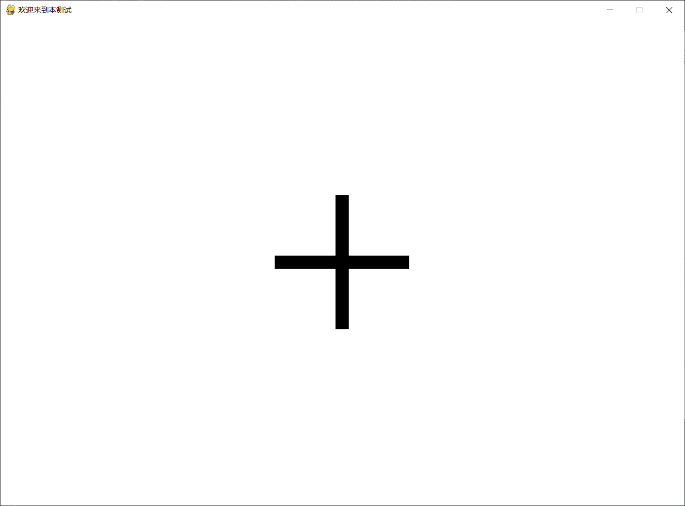

# 注视点稳定性任务示意图
## 要求


## 实现
### 配置文件
+ 为了保证可以自由更改参数，并且适配各种显示器，提供了一个配置文件[`config.json`](config.json)，所有参数都可以在这里面更改。
  ```json
  {
    "MONITOR": [ //控制显示器长宽
        1080,
        768
    ],
    "distanceOfSubject": 30, //受试者眼球到屏幕间的距离（厘米）
    "angleRange": [ // 干扰点的渲染“视角”范围，（度）
        6,
        12
    ],
    "pixelPerCM": 49.4, // 对于当前显示器，每厘米有多少像素
    "BlackCrossDiameter": 4.3, // 第一阶段的黑十字的大小（厘米）
    "blackPointDiameterAngle" : 0.5 // 中央黑点的视角大小（度）
    }
  ```
### 获取当前显示器分辨率的脚本
+ [`getPixelPerCM.py`](getPixelPerCM.py)
+ 执行该脚本后，会渲染一个有一条红线的界面，此时单击图像任意位置即可渲染第二条红线
  
   

+ 只需你保证这两条红线在显示器上实际测量的距离为5cm后，即可敲击键盘的`ENTER`键确认此信息，脚本会自动修改`config.json`中的参数为此次测量后的数值。

### 使用
+ [`visionStable.py`](visionStable.py)是主要的运行脚本，渲染了符合需求的图像序列，只要配置文件和校准正确就能保证正常运行。
  + 待机状态图片
  
  

  + 人屏距离30cm时的混淆状态中心点和混淆点
  